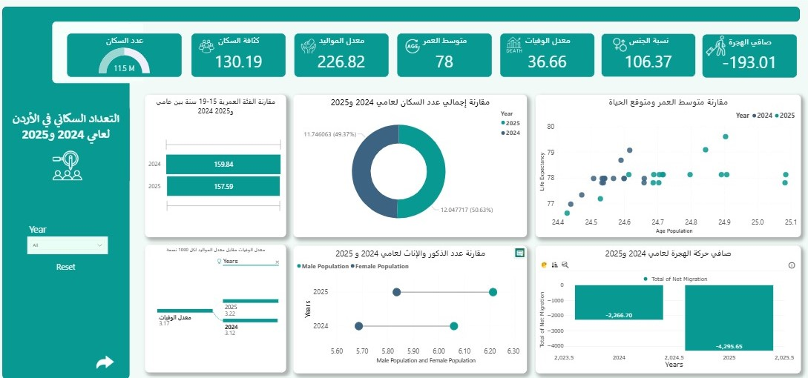
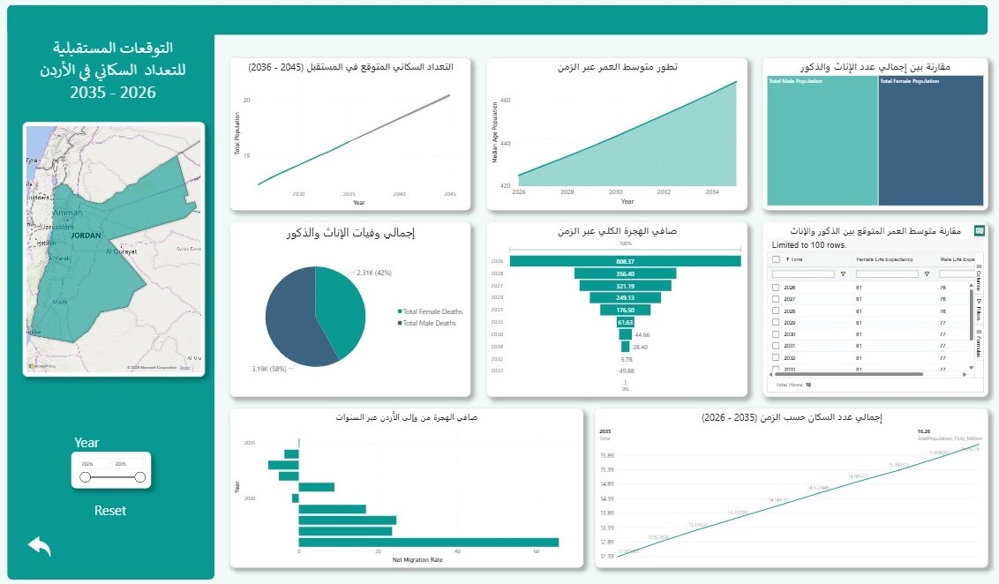

## 📊 Jordan Population Dashboard (2024–2035)

This Power BI project includes two main interactive dashboards that visualize Jordan's population data. The first page analyzes the population structure and key demographic indicators for 2024 and 2025, while the second page forecasts future trends from 2026 to 2035.

### 📄 Dashboard Pages

#### 1️⃣ Page One: 2024–2025 Analysis

* Total population comparison between 2024 and 2025
* Gender distribution
* Birth and death rates per 1,000 people
* Net migration trends
* Median age and life expectancy
* Age group focus (15–19 years)

#### 2️⃣ Page Two: 2026–2035 Forecast

* Projected total population growth
* Life expectancy trends for males and females
* Future net migration patterns
* Median age evolution over time
* Gender-based death count comparison

## 🖼️ Dashboard Previews

### Page 1: Population Analysis (2024–2025)

### Page 2: Future Forecast (2026–2035)

### 🛠️ Tools Used
* **Data Source:** United Nations, Department of Economic and Social Affairs, Population Division (2024). World Population Prospects 2024: Standard Projections. Retrieved from https://population.un.org/wpp
* **Power BI Desktop**
* **Forecasting & DAX Formulas**

